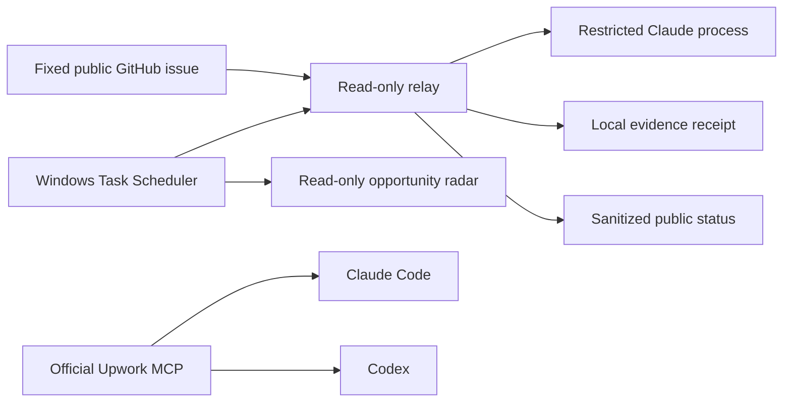

# Bounded Desktop Automation + Upwork MCP

**Date:** 2026-09-24

**Publication class:** Public summary

**Status:** Scheduled read-only relay, recurring radar, and authenticated Upwork read path verified

## Problem

An interactive desktop connector can become unavailable because of quota or
session state. HAL still needs a durable way to request local diagnostics,
observe the result, and continue revenue research without turning a public
queue into an unrestricted remote shell.

The same integration needed to connect Upwork to local assistants without
equating a configured connector, prepared proposal, or authenticated account
with a submitted application or earned revenue.

## Architecture

The relay verifies the fixed repository, issue, owner login, immutable owner
identity, schema, mode, working root, duration, task-id format, and field set.
Its first deployed version executes only `read_only` work orders. Claude runs
with file read and search tools, an empty MCP configuration, no command tool,
no permission prompts, and no persistent session.

Raw model output remains local. Public result comments are generated by the
relay and contain status metadata plus a receipt hash. The public issue never
receives the model's filesystem observations or account data.

## Failure-driven hardening

Two canaries failed safely before the successful run:

1. A long diagnostic prompt exceeded Windows command-line length limits.
2. Inline empty MCP JSON lost quoting across the Windows PowerShell boundary.

The final relay passes prompts through standard input and loads an empty MCP
configuration from a local file. The third canary completed with exit code
zero. Earlier failures remain in the evidence trail instead of being rewritten
as success.

The first scheduled radar cycle then hit a transient remote connection reset.
Its fail-safe behavior preserved the prior good baseline and wrote a failed
receipt. The HTTP helper was updated with a bounded three-attempt retry for
network and timeout failures while preserving immediate handling of real HTTP
responses. The full Revenue OS suite passed 111 tests, all modules compiled,
and the same radar task then completed successfully through Task Scheduler.

## Verified result

- The relay's successful canary ran in read-only mode and returned exit code 0.
- The successful public status contains no raw model output.
- The relay scheduler completed independently with Windows task result 0 and
  repeats every five minutes.
- The revenue radar completed independently with Windows task result 0 and
  repeats every thirty minutes.
- The fresh radar receipt contained 362 rows, one `watch`, zero new or upgraded
  opportunities, and no claim or submission.
- The official Upwork MCP endpoint connected through OAuth in Claude Code and
  Codex.
- An authenticated smoke test invoked only the read-only Upwork account-list
  method and returned `ok: true`; response identifiers and account content are
  excluded from public evidence.
- Existing Claude permission settings were preserved. The supplied installer
  was audited rather than executed unchanged.

Machine-readable evidence:

- [Verification receipt](../evidence/portfolio/bounded_desktop_automation_upwork_mcp_2026-09-24.json)
- [Public relay evidence trail](https://github.com/UniteAndCreateForLife/HAL_SUPREME/issues/35)

## Authority boundaries

This verified path does not authorize:

- arbitrary shell commands from the public queue;
- local engineering edits or WorkGraph promotion through the relay;
- raw model output in the public issue;
- Upwork proposals, messages, invitation responses, profile changes, offers,
  milestones, or other writes;
- Connects spending, boosts, purchases, contracts, payouts, tax, identity,
  legal, or credential changes; or
- treating prepared work, advertised value, or an authenticated connector as
  submitted work, awarded work, income, or cash received.

## Limitations

- The relay currently provides read-only diagnostics. Engineering execution
  must still enter HAL's reviewed WorkGraph and local executor path.
- The scheduled tasks use the current user's interactive Windows session; they
  do not store a Windows password.
- Remote source health and MCP schemas are dated observations and may change.
- Local paths, usernames, GitHub numeric ids, account identifiers, OAuth data,
  opportunity URLs, proposal packets, credentials, and private receipts are
  excluded.
