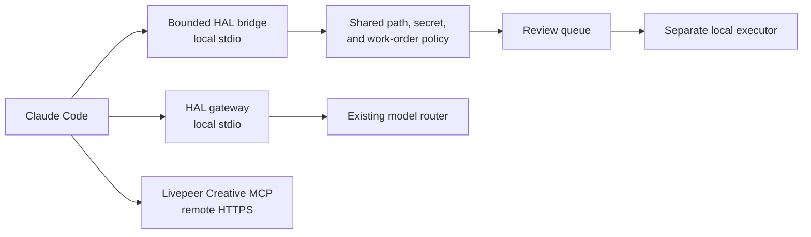

# Claude Code + HAL MCP Fabric

**Date:** 2026-09-24

**Publication class:** Public summary

**Status:** Authenticated end-to-end integration verified

## Problem

HAL already had durable work state, bounded tool bridges, a local model gateway,
and a large creative provider catalog. Adding another coding assistant could
easily create duplicate authority, expose a private connector secret, or make a
configured integration look operational before the assistant had called it.

The goal was to add Claude Code as another replaceable engineering worker while
keeping HAL's existing owners for tasks, history, execution, model routing, and
media policy.

## Implementation

Claude Code receives a concise repository map plus project-scoped permissions.
Three MCP connections provide progressive access:

The local bridge reuses the same bounded implementation as the existing remote
assistant bridge. It does not copy the private HTTP connector URL into project
configuration. Its write-shaped methods can stage text or create a
`queued_for_review` work order; they cannot execute the work order.

Project permissions deny secret-like paths and destructive Git operations.
Provider generation, code execution, public Git actions, and work-order staging
remain permission-prompted. Permission bypass is disabled.

## Verified result

- Claude Code 2.1.281 passed its installation health check.
- The bounded HAL bridge connected and exposed exactly 11 tools.
- The HAL gateway connected and exposed exactly 5 tools.
- The Livepeer Creative MCP connected and exposed 125 methods.
- The sorted Livepeer method-name set has SHA-256
  `dbc911c047f26e8760d7cd9ad9a1f89c7e40debb91fce0df420ea34a97861d9f`.
- An authenticated Claude process invoked `bridge_status`, `gateway_health`,
  and `livepeer_status`.
- The verifier observed all three tool-use events and an `ok: true` result for
  every call.
- No unexpected substantive tool ran. Claude's internal `ToolSearch` was the
  expected discovery step for the deferred provider catalog.
- Thirty focused bridge, MCP, and Livepeer regression tests passed.
- The wider private HAL acceptance gate remained at its existing 98/99
  baseline, with one pre-existing operator-conversation assertion failure and
  no new failing suite.

Machine-readable evidence:

- [Authenticated integration receipt](../evidence/portfolio/claude_hal_mcp_fabric_2026-09-24.json)

## Authority boundaries

The integration does not give the bounded bridge authority to:

- execute queued work orders;
- run arbitrary host shell or browser operations;
- purchase services or consume provider grants without review;
- submit applications, claims, pull requests, email, or public messages;
- change payout, identity, legal, tax, account, or credential state; or
- read credential-like paths.

Claude Code can still perform ordinary repository work through its native tools,
subject to the project's permission rules and HAL's repository instructions.

## Limitations and non-claims

- This proves a local authenticated engineering path, not an unattended hosted
  Claude deployment.
- Remote catalogs and service health are dated observations and may change.
- Optional third-party connectors synchronized by the Claude account were not
  included in this proof.
- No media job, upload, application, purchase, account change, credential
  operation, or external client submission was performed during verification.
- Account identifiers, local filesystem paths, private connector material,
  operational work records, client packets, and credentials are excluded.
