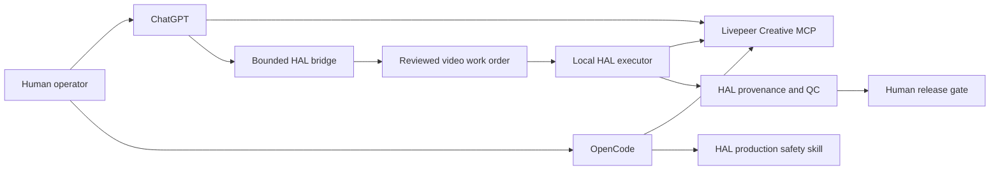

# Case Study: ChatGPT + OpenCode + Livepeer Creative MCP

**Status:** connected and read-only verified
**Observed:** 2026-09-24
**Maintainer:** UniteAndCreateForLife

## Objective

Give ChatGPT, OpenCode, and HAL direct access to Livepeer’s current creative tool surface while preserving HAL’s authority over work state, evidence, spending, and external release.

## Delivered architecture



The Livepeer MCP is a replaceable creative worker. HAL’s local work graph, evidence, and release controls remain authoritative.

## What was implemented

- Packaged and installed a ChatGPT plugin that points to the Livepeer Creative MCP Streamable HTTP endpoint.
- Registered the complete MCP server directly so ChatGPT can reach the full method catalog when a plugin loader presents only a limited window.
- Connected OpenCode 1.18.18 to the same complete remote catalog, raised the catalog timeout for the large method surface, and required interactive review for every Livepeer tool call.
- Added a reusable OpenCode production skill that requires current capability and pricing evidence plus exact approval before provider mutation.
- Added a public Python client that discovers current tool schemas at runtime instead of freezing signatures that will become stale.
- Kept bearer credentials in HTTP headers and out of JSON-RPC bodies, logs, receipts, and Git.
- Added an explicit execution latch before provider tool calls that may consume credits or create media.
- Added bounded HAL status and video work-order paths. Work orders are review records; they do not execute provider jobs.
- Preserved human gates for spend, generation, upload, publication, identity, legal, and account actions.

## Fresh verification

| Check | Result |
|---|---:|
| MCP server | `livepeer-agent-creative` v1.0.0 |
| Negotiated MCP protocol | `2025-11-25` |
| Callable MCP methods | **125** |
| Available capabilities | **209** |
| AI capabilities | **175** |
| Production tools | **34** |
| OpenCode client | **1.18.18** |
| OpenCode MCP status | **Connected** |
| Provider catalog during OpenCode verification | **125 methods** |
| OpenCode provider calls | **Review required** |
| Required workflow methods present | Yes |
| Bounded HAL bridge methods | **11** |
| HAL bridge local/public protocol checks | Passing |
| Public client unit tests | 4 passing |
| Media generated during inventory | No |
| Provider mutation during inventory | No |

The required-method check included capability discovery, pricing, media creation, multi-scene jobs, video analysis, assembly, lineage, identity/usage status, and spend controls. This verification called discovery and status methods only.

## Why this matters

HAL can now use one live interface for image, video, audio, 3D, editing, critique, assembly, export, and provenance-related production tasks. ChatGPT can inspect and prepare work, while OpenCode can use the complete catalog during an interactive engineering session. Runtime discovery gives the video system access to new provider capabilities without treating the provider as a second workflow authority.

The integration also creates a practical alternative to general desktop-control tools. ChatGPT can inspect the media surface and prepare structured work while local HAL remains responsible for execution, test evidence, and final release.

## Reproduce the public checks

```bash
python -m unittest -v tests.test_livepeer_creative_client
python scripts/livepeer_creative.py doctor
python scripts/livepeer_creative.py tools
```

The committed machine receipt is [`evidence/portfolio/livepeer_chatgpt_mcp_2026-09-24.json`](../evidence/portfolio/livepeer_chatgpt_mcp_2026-09-24.json). The safe ChatGPT plugin source is published at [`plugins/livepeer-creative-mcp/`](../plugins/livepeer-creative-mcp/). Catalog counts are a dated snapshot and may change as Livepeer adds or retires capabilities.

## Authority boundary

The read-only inventory did not generate media, upload assets, consume a paid account balance, publish content, or modify account state. Any later provider mutation requires the exact tool, model, inputs, expected cost, and explicit operator approval.
