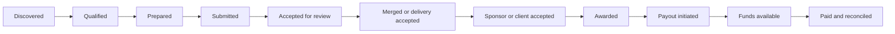

# Revenue Truth Control Plane

**Date:** 2026-09-24

**Publication class:** Public artifact

**Status:** Local implementation verified; external revenue outcomes excluded

## Problem

Revenue pipelines often collapse several different facts into one optimistic
status. A prepared proposal can look submitted, a merged pull request can look
awarded, and a funded bounty pool can look like money received. Those shortcuts
make automation unsafe and reporting unreliable.

## Implementation

The public example implements an eleven-stage, evidence-bound projection over an
existing opportunity ledger. Explicit evidence can advance a record; the
projection does not invent later stages from earlier work.

Each projected record keeps advertised value separate from verified paid value
and can expose funding state, payout rail, onboarding state, contention, exact
evidence SHA, terms freshness, follow-up timing, and the next human action.

The UI built around this projection also keeps human-gated actions visible near
the pipeline. Account identity, legal attestations, spending, submissions, and
payout mutations remain outside projection authority.

## Verified result

- Six focused invariant tests pass.
- Python compilation succeeds.
- JavaScript syntax verification succeeds for the private operator interface.
- A fresh local browser render completed with zero console errors and zero
  warnings.
- External writes and spending remained disabled throughout verification.

Public source and tests:

- [`examples/revenue_truth/revenue_projection.py`](../examples/revenue_truth/revenue_projection.py)
- [`examples/revenue_truth/test_revenue_projection.py`](../examples/revenue_truth/test_revenue_projection.py)
- [Machine-readable receipt](../evidence/portfolio/revenue_truth_control_plane_2026-09-24.json)

## Design decisions

1. **Projection instead of parallel authority.** The component reads existing
   records and produces rebuildable UI state.
2. **Conservative inference.** Submitted, merged, accepted, awarded, and paid
   require their own evidence.
3. **Idempotent reporting.** Rebuilding the projection does not create receipts,
   submit work, or mutate the ledger.
4. **Human gates stay explicit.** Spending, identity, legal claims, account
   changes, and external submissions are visible actions for an operator.
5. **Evidence is portable.** Exact SHAs and evidence URIs can be rendered
   without copying secrets or private account data into the public artifact.

## Limitations and non-claims

- The public artifact is a reusable projection module and focused test suite,
  not the private operator application or its operational ledger.
- No application, claim, proposal, payment, account change, or public message
  was sent during this work.
- A successful local render does not prove sponsor acceptance, an award, or
  payment.
- Private opportunity rows, local paths, account state, payout data, and client
  identity are excluded.
